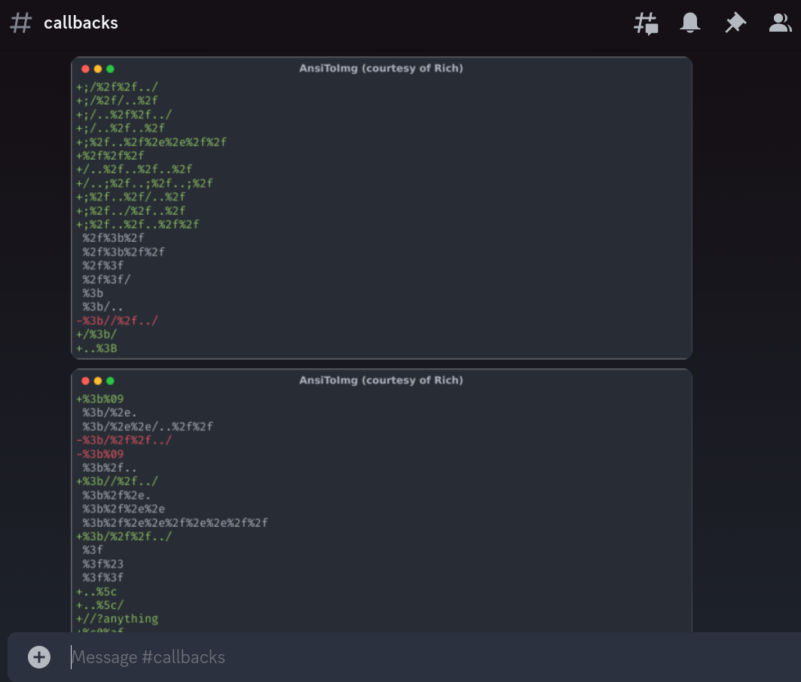

# push-my-diffs

A dead-simple code differ and renderer to review code at your own pace!

## Setup

```bash
git clone https://github.com/laluka/push-my-diffs
sudo mv push-my-diffs /opt
cd /opt/push-my-diffs
mkdir git-repos
# Clone the repos you want to monitor
git clone https://github.com/laluka/bypass-url-parser
sudo mv bypass-url-parser git-repos/
# Build the image
docker build -t push-my-diffs:latest .
# Run the tool with your webhook
export DISCORD_WEBHOOK=https://discord.com/api/webhooks/YYYY/ZZZZ
docker run --rm -d -v "/opt/push-my-diffs/git-repos:/opt/git-repos" -e "DISCORD_WEBHOOK=$DISCORD_WEBHOOK" push-my-diffs:latest
# Add the daily run in your crontab, here DAILY run is at 8am
echo "0 20 * * * root docker run --rm -d -v /opt/push-my-diffs/git-repos:/opt/git-repos -e DISCORD_WEBHOOK=$DISCORD_WEBHOOK push-my-diffs:latest 2>&1 >> /tmp/log" | sudo tee -a /etc/crontab
```

## Expected output

